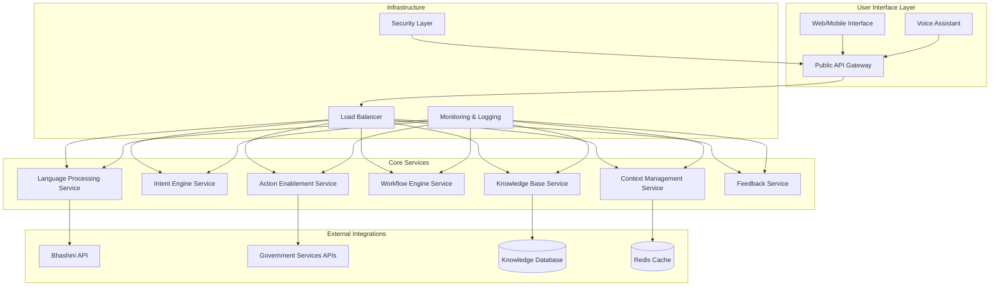

# Design Document: Astraea Civic Intelligence Agent

## Overview

The Astraea Civic Intelligence Agent is a microservices-based conversational AI system designed to democratize access to government services across India. The system leverages India's Bhashini platform for multilingual capabilities, implements advanced NLP for intent understanding, and provides guided workflows for civic processes.

The architecture follows a distributed, cloud-native approach with independent services for language processing, intent recognition, knowledge management, workflow orchestration, and feedback collection. This design ensures scalability, maintainability, and the ability to handle diverse user needs across India's linguistic and digital literacy spectrum.

## Architecture

### High-Level Architecture



### Service Architecture Pattern

The system follows a microservices architecture with the following principles:
- **Service Independence**: Each service can be developed, deployed, and scaled independently
- **API-First Design**: All inter-service communication through well-defined REST APIs
- **Event-Driven Communication**: Asynchronous messaging for non-blocking operations
- **Stateless Services**: Services maintain no session state, enabling horizontal scaling
- **Circuit Breaker Pattern**: Fault tolerance and graceful degradation

## Components and Interfaces

### 1. Language Processing Service (LPS)

**Responsibilities:**
- Multilingual text and speech processing
- Language detection and translation
- Speech-to-text and text-to-speech conversion
- Code-mixing handling

**Key Interfaces:**
```typescript
interface LanguageProcessingService {
  detectLanguage(input: string): Promise<LanguageDetectionResult>
  translateText(text: string, fromLang: string, toLang: string): Promise<TranslationResult>
  speechToText(audioData: Buffer, language: string): Promise<SpeechToTextResult>
  textToSpeech(text: string, language: string, voice: VoiceType): Promise<AudioBuffer>
  processCodeMixing(text: string): Promise<ProcessedText>
}

interface LanguageDetectionResult {
  primaryLanguage: string
  confidence: number
  alternativeLanguages: LanguageConfidence[]
}
```

**External Dependencies:**
- Bhashini API for translation and speech processing
- Custom models for code-mixing detection

### 2. Intent Engine Service (IES)

**Responsibilities:**
- Natural language understanding
- Intent classification and entity extraction
- Query disambiguation
- Confidence scoring

**Key Interfaces:**
```typescript
interface IntentEngineService {
  classifyIntent(query: string, language: string, context: UserContext): Promise<IntentResult>
  extractEntities(query: string, language: string): Promise<EntityExtractionResult>
  disambiguateQuery(query: string, context: UserContext): Promise<DisambiguationResult>
  validateIntent(intent: Intent, entities: Entity[]): Promise<ValidationResult>
}

interface IntentResult {
  intent: string
  confidence: number
  entities: Entity[]
  requiresClarification: boolean
  clarificationQuestions: string[]
}
```

### 3. Context Management Service (CMS)

**Responsibilities:**
- User session management
- Context preservation across conversations
- Eligibility determination
- Location-based filtering

**Key Interfaces:**
```typescript
interface ContextManagementService {
  createSession(userId: string): Promise<SessionContext>
  updateContext(sessionId: string, updates: ContextUpdate): Promise<SessionContext>
  getEligibility(userId: string, serviceId: string): Promise<EligibilityResult>
  getLocationContext(location: LocationInfo): Promise<LocationContext>
  maintainConversationHistory(sessionId: string, interaction: Interaction): Promise<void>
}

interface SessionContext {
  sessionId: string
  userId: string
  language: string
  location: LocationInfo
  userProfile: UserProfile
  conversationHistory: Interaction[]
  currentIntent: string
  eligibilityCache: Map<string, EligibilityResult>
}
```

### 4. Knowledge Base Service (KBS)

**Responsibilities:**
- Government service information retrieval
- Policy and scheme data management
- Content versioning and updates
- Simplified explanation generation

**Key Interfaces:**
```typescript
interface KnowledgeBaseService {
  searchServices(query: string, filters: SearchFilters): Promise<ServiceSearchResult[]>
  getServiceDetails(serviceId: string, language: string): Promise<ServiceDetails>
  getEligibilityCriteria(serviceId: string): Promise<EligibilityCriteria>
  getRequiredDocuments(serviceId: string): Promise<DocumentRequirement[]>
  getSimplifiedExplanation(serviceId: string, language: string): Promise<SimplifiedContent>
  updateServiceInfo(serviceId: string, updates: ServiceUpdate): Promise<void>
}

interface ServiceDetails {
  serviceId: string
  name: string
  description: string
  eligibilityCriteria: EligibilityCriteria
  requiredDocuments: DocumentRequirement[]
  applicationProcess: ProcessStep[]
  timelines: Timeline[]
  contactInfo: ContactInfo
  lastUpdated: Date
}
```

### 5. Workflow Engine Service (WES)

**Responsibilities:**
- Step-by-step process guidance
- Progress tracking
- Adaptive workflow management
- Validation and checkpoints

**Key Interfaces:**
```typescript
interface WorkflowEngineService {
  initiateWorkflow(serviceId: string, userContext: UserContext): Promise<WorkflowInstance>
  getNextStep(workflowId: string): Promise<WorkflowStep>
  validateStep(workflowId: string, stepData: StepData): Promise<ValidationResult>
  updateProgress(workflowId: string, completedStep: string): Promise<WorkflowProgress>
  getAlternativeApproaches(workflowId: string, stuckStep: string): Promise<Alternative[]>
}

interface WorkflowInstance {
  workflowId: string
  serviceId: string
  userId: string
  currentStep: string
  completedSteps: string[]
  progress: number
  estimatedTimeRemaining: number
  nextSteps: WorkflowStep[]
}
```

### 6. Action Enablement Service (AES)

**Responsibilities:**
- Government portal integration
- Form assistance and pre-filling
- Document upload guidance
- Application tracking

**Key Interfaces:**
```typescript
interface ActionEnablementService {
  getPortalLinks(serviceId: string, location: LocationInfo): Promise<PortalLink[]>
  assistFormCompletion(formId: string, userData: UserData): Promise<FormAssistance>
  validateDocuments(documents: Document[], requirements: DocumentRequirement[]): Promise<DocumentValidation>
  trackApplication(applicationId: string, serviceId: string): Promise<ApplicationStatus>
  generatePreSubmissionChecklist(workflowId: string): Promise<Checklist>
}

interface FormAssistance {
  formId: string
  preFilledFields: Map<string, any>
  fieldGuidance: Map<string, string>
  validationRules: ValidationRule[]
  helpText: Map<string, string>
}
```

### 7. Feedback Service (FS)

**Responsibilities:**
- User feedback collection
- Response quality assessment
- Learning and improvement
- Analytics and reporting

**Key Interfaces:**
```typescript
interface FeedbackService {
  collectFeedback(sessionId: string, feedback: UserFeedback): Promise<void>
  reportIncorrectInfo(serviceId: string, incorrectInfo: IncorrectInfoReport): Promise<void>
  analyzeSatisfaction(timeRange: TimeRange): Promise<SatisfactionAnalytics>
  identifyImprovementAreas(): Promise<ImprovementArea[]>
  updateResponseQuality(interactionId: string, qualityScore: number): Promise<void>
}

interface UserFeedback {
  sessionId: string
  rating: number
  accuracy: number
  helpfulness: number
  clarity: number
  comments: string
  suggestedImprovements: string[]
}
```

## Data Models

### Core Entities

```typescript
// User and Session Models
interface User {
  userId: string
  preferredLanguage: string
  location: LocationInfo
  digitalLiteracyLevel: DigitalLiteracyLevel
  accessibilityNeeds: AccessibilityRequirement[]
  consentPreferences: ConsentPreferences
}

interface LocationInfo {
  state: string
  district: string
  pincode: string
  coordinates?: GeoCoordinates
}

// Service and Knowledge Models
interface GovernmentService {
  serviceId: string
  name: MultilingualText
  category: ServiceCategory
  description: MultilingualText
  eligibilityCriteria: EligibilityCriteria
  requiredDocuments: DocumentRequirement[]
  applicationProcess: ProcessStep[]
  applicableRegions: LocationInfo[]
  contactInfo: ContactInfo
  lastUpdated: Date
  version: string
}

interface EligibilityCriteria {
  ageRange?: AgeRange
  incomeRange?: IncomeRange
  residencyRequirements: string[]
  categoryRequirements: string[]
  documentRequirements: string[]
  customCriteria: Map<string, any>
}

// Conversation and Interaction Models
interface Interaction {
  interactionId: string
  sessionId: string
  timestamp: Date
  userInput: UserInput
  systemResponse: SystemResponse
  intent: string
  entities: Entity[]
  confidence: number
  language: string
}

interface UserInput {
  type: InputType // TEXT, VOICE, BUTTON_CLICK
  content: string
  metadata: InputMetadata
}

interface SystemResponse {
  type: ResponseType // TEXT, VOICE, FORM, LINK
  content: MultilingualText
  actions: Action[]
  suggestions: string[]
  metadata: ResponseMetadata
}

// Workflow Models
interface WorkflowStep {
  stepId: string
  name: string
  description: MultilingualText
  type: StepType // INFORMATION, INPUT, VALIDATION, ACTION
  required: boolean
  inputs: InputField[]
  validationRules: ValidationRule[]
  helpText: MultilingualText
  estimatedTime: number
}

interface ProcessStep {
  stepNumber: number
  title: string
  description: string
  requiredInputs: string[]
  expectedOutputs: string[]
  dependencies: string[]
  alternativeApproaches: string[]
}
```

### Data Storage Strategy

**Primary Database (PostgreSQL):**
- Government service definitions and metadata
- User profiles and preferences
- Workflow definitions and templates
- Feedback and analytics data

**Cache Layer (Redis):**
- Session contexts and conversation state
- Frequently accessed service information
- Translation cache for common phrases
- User eligibility determinations

**Document Store (MongoDB):**
- Multilingual content and explanations
- Conversation logs and interaction history
- Unstructured feedback and comments
- Knowledge base articles and FAQs

## Correctness Properties

*A property is a characteristic or behavior that should hold true across all valid executions of a system—essentially, a formal statement about what the system should do. Properties serve as the bridge between human-readable specifications and machine-verifiable correctness guarantees.*

Based on the prework analysis, I've identified properties that can be tested across all inputs and consolidated redundant ones. Here are the key correctness properties:

### Language Processing Properties

**Property 1: Language Detection Accuracy**
*For any* text input in a supported Indian language, the language detection system should identify the correct language with confidence above the minimum threshold
**Validates: Requirements 1.1**

**Property 2: Speech Recognition Accuracy**
*For any* voice input in a supported language, the speech-to-text conversion should achieve accuracy above 85%
**Validates: Requirements 1.3**

**Property 3: Language Consistency**
*For any* user input in a specific language, the system response should be provided in the same language
**Validates: Requirements 1.4**

**Property 4: Language Switching Adaptation**
*For any* conversation where the user switches languages, the system should adapt to the new language within the same session
**Validates: Requirements 1.5**

**Property 5: Code-mixing Handling**
*For any* input containing mixed English and regional language text, the system should process it appropriately without losing meaning
**Validates: Requirements 1.6**

### Intent Understanding Properties

**Property 6: Intent Classification Confidence**
*For any* natural language query about civic services, the intent classification should achieve confidence above 80%
**Validates: Requirements 2.1**

**Property 7: Location-based Response Filtering**
*For any* query with available location information, responses should be filtered to include only location-relevant policies and services
**Validates: Requirements 2.2**

**Property 8: Eligibility Determination Accuracy**
*For any* user profile with complete personal details, the system should correctly determine eligibility for all relevant government schemes
**Validates: Requirements 2.3**

**Property 9: Ambiguity Resolution**
*For any* ambiguous query, the system should request clarification rather than providing potentially incorrect guidance
**Validates: Requirements 2.4**

**Property 10: Context Validation**
*For any* interaction with insufficient context, the system should request additional information before providing guidance
**Validates: Requirements 2.5**

**Property 11: Conversation Continuity**
*For any* multi-turn conversation, follow-up responses should be contextually relevant to the conversation history
**Validates: Requirements 2.6**

### Knowledge Base Properties

**Property 12: Explanation Simplification**
*For any* government service query, the provided explanation should avoid technical jargon and meet readability standards for basic literacy
**Validates: Requirements 3.2**

**Property 13: Service Information Completeness**
*For any* government service in the knowledge base, it should include eligibility criteria, required documents, application processes, and timelines
**Validates: Requirements 3.3**

**Property 14: Information Accuracy**
*For any* government service information provided, it should match official sources with accuracy above 95%
**Validates: Requirements 3.5**

**Property 15: Service Variant Explanation**
*For any* government service with multiple variants, the system should explain differences and help users choose the appropriate option
**Validates: Requirements 3.6**

### Workflow Engine Properties

**Property 16: Workflow Generation Completeness**
*For any* selected government service, the system should provide a complete structured step-by-step process
**Validates: Requirements 4.1**

**Property 17: Progress-based Workflow Adaptation**
*For any* workflow in progress, guidance should adapt based on the user's current progress and completed steps
**Validates: Requirements 4.2**

**Property 18: Stuck State Assistance**
*For any* workflow step where a user indicates difficulty, the system should provide additional clarification and alternative approaches
**Validates: Requirements 4.3**

**Property 19: Step Validation Completeness**
*For any* workflow step with user input, the system should validate inputs before allowing progression to the next step
**Validates: Requirements 4.4**

**Property 20: Prerequisite Guidance**
*For any* workflow with missing prerequisites, the system should guide users to complete necessary preliminary steps
**Validates: Requirements 4.5**

**Property 21: Timeline and Next Step Provision**
*For any* completed workflow action, the system should provide estimated timelines and clear next steps
**Validates: Requirements 4.6**

### Action Enablement Properties

**Property 22: Portal Link Provision**
*For any* applicable government service, the system should provide direct links to official portals and application forms
**Validates: Requirements 5.1**

**Property 23: Form Completion Guidance**
*For any* government form, the system should provide field-by-field assistance throughout the completion process
**Validates: Requirements 5.2**

**Property 24: Document Requirement Specification**
*For any* service requiring document uploads, the system should specify exact format, size, and quality requirements
**Validates: Requirements 5.3**

**Property 25: Pre-submission Checklist Generation**
*For any* application ready for submission, the system should provide a comprehensive completeness checklist
**Validates: Requirements 5.4**

**Property 26: Application Tracking Provision**
*For any* submitted application, the system should provide tracking information and follow-up guidance
**Validates: Requirements 5.5**

**Property 27: Status Change Notification**
*For any* application with available tracking, the system should notify users of status changes
**Validates: Requirements 5.6**

### Feedback and Learning Properties

**Property 28: Feedback Prompt Consistency**
*For any* concluded conversation, the system should prompt users to rate their experience
**Validates: Requirements 6.1**

**Property 29: Comprehensive Feedback Collection**
*For any* feedback session, the system should collect ratings on response accuracy, helpfulness, and process clarity
**Validates: Requirements 6.2**

**Property 30: Incorrect Information Flagging**
*For any* report of incorrect information, the system should flag the content for review within the specified timeframe
**Validates: Requirements 6.3**

**Property 31: Limitation-based Escalation**
*For any* feedback indicating system limitations, the system should escalate to human support when available
**Validates: Requirements 6.6**

### System Performance Properties

**Property 32: Overload Queue Management**
*For any* system load exceeding capacity, requests should be queued with estimated wait times provided to users
**Validates: Requirements 7.4**

### Accessibility Properties

**Property 33: Response Readability**
*For any* system response, the language should be simple and conversational, appropriate for users with basic literacy
**Validates: Requirements 8.2**

**Property 34: Audio Output Availability**
*For any* text response, audio output should be available for users with visual impairments
**Validates: Requirements 8.3**

**Property 35: Visual Aid Inclusion**
*For any* response to users with limited reading ability, appropriate visual aids and icons should be included
**Validates: Requirements 8.6**

### Security and Privacy Properties

**Property 36: Data Encryption Completeness**
*For any* personal data handled by the system, it should be encrypted both in transit and at rest
**Validates: Requirements 9.1**

**Property 37: Session Data Cleanup**
*For any* user session, sensitive personal information should not be stored beyond the active session unless explicitly consented
**Validates: Requirements 9.2**

**Property 38: Sensitive Data Masking**
*For any* input containing Aadhaar or other identity numbers, these should be masked in logs and conversations
**Validates: Requirements 9.3**

**Property 39: Breach Notification Timeliness**
*For any* data breach occurrence, affected users should be notified within 72 hours
**Validates: Requirements 9.6**

### Ethical AI Properties

**Property 40: Service Quality Consistency**
*For any* supported language and region combination, service quality should remain consistent
**Validates: Requirements 10.1**

**Property 41: Non-discrimination Assurance**
*For any* user profile, responses should not vary based on demographics, location, or socioeconomic indicators
**Validates: Requirements 10.2**

**Property 42: Explanation Transparency**
*For any* eligibility determination or recommendation, the system should provide transparent explanations
**Validates: Requirements 10.5**

<function_calls>
<invoke name="prework">
<parameter name="featureName">astraea-civic-intelligence-agent

## Error Handling

### Error Categories and Strategies

**1. Language Processing Errors**
- **Speech Recognition Failures**: Fallback to text input, request clearer audio
- **Translation Errors**: Use alternative translation services, request language clarification
- **Code-mixing Confusion**: Break down mixed input, process components separately

**2. Intent Understanding Errors**
- **Low Confidence Classification**: Request clarification, provide intent options
- **Entity Extraction Failures**: Ask specific questions to gather missing entities
- **Context Ambiguity**: Maintain conversation state, ask disambiguating questions

**3. Knowledge Base Errors**
- **Service Information Not Found**: Suggest similar services, escalate to human support
- **Outdated Information**: Flag for update, provide disclaimer about information age
- **Incomplete Service Data**: Clearly indicate missing information, provide partial guidance

**4. Workflow Execution Errors**
- **Step Validation Failures**: Provide specific error messages, suggest corrections
- **Prerequisite Missing**: Guide to prerequisite completion, provide alternative paths
- **External Service Unavailable**: Provide offline alternatives, estimated restoration time

**5. System Integration Errors**
- **Government Portal Failures**: Provide alternative access methods, manual process guidance
- **Third-party API Failures**: Use cached data when available, graceful degradation
- **Database Connectivity Issues**: Use read replicas, provide basic cached responses

### Error Recovery Patterns

**Graceful Degradation**:
- Maintain core functionality even when advanced features fail
- Provide manual alternatives when automated processes fail
- Cache critical information for offline access

**User Communication**:
- Clear, non-technical error messages in user's preferred language
- Specific guidance on how to proceed despite errors
- Estimated resolution times when available

**Escalation Paths**:
- Automatic escalation to human support for critical failures
- User-initiated escalation option always available
- Clear handoff of context to human agents

## Testing Strategy

### Dual Testing Approach

The Astraea Civic Intelligence Agent requires both unit testing and property-based testing to ensure comprehensive coverage:

**Unit Tests** focus on:
- Specific examples of government service interactions
- Edge cases like malformed input or missing data
- Integration points between microservices
- Error conditions and recovery scenarios
- Accessibility features for different user needs

**Property-Based Tests** focus on:
- Universal properties that hold across all inputs
- Language processing accuracy across all supported languages
- Intent classification consistency across diverse queries
- Workflow completeness for all government services
- Security and privacy compliance across all interactions

### Property-Based Testing Configuration

**Testing Framework**: Use Hypothesis (Python) or fast-check (TypeScript) for property-based testing
**Test Iterations**: Minimum 100 iterations per property test to ensure statistical significance
**Test Data Generation**: 
- Multilingual text generators for all supported Indian languages
- Government service data generators covering all categories
- User profile generators representing diverse demographics
- Conversation flow generators for multi-turn interactions

**Property Test Tagging**: Each property-based test must include a comment referencing its design document property:
```python
# Feature: astraea-civic-intelligence-agent, Property 1: Language Detection Accuracy
def test_language_detection_accuracy(text_input, expected_language):
    # Test implementation
```

### Testing Environments

**Development Testing**:
- Mock external services (Bhashini, government portals)
- Synthetic data for all government services
- Simulated user interactions across all supported languages

**Staging Testing**:
- Integration with actual Bhashini API
- Subset of real government service data
- Performance testing under simulated load

**Production Testing**:
- Continuous monitoring of property compliance
- A/B testing for new features
- Real-time feedback integration for quality assessment

### Accessibility Testing

**Digital Literacy Testing**:
- Test with users having varying levels of digital literacy
- Validate voice interface effectiveness
- Ensure visual aids support comprehension

**Language Accessibility**:
- Test code-mixing scenarios across all language pairs
- Validate translation quality for technical terms
- Ensure cultural appropriateness of responses

**Device Compatibility**:
- Test on low-end smartphones with limited resources
- Validate offline functionality
- Ensure responsive design across screen sizes

### Security Testing

**Data Protection Testing**:
- Verify encryption implementation for all data flows
- Test data masking for sensitive information
- Validate session cleanup and data retention policies

**Privacy Compliance Testing**:
- Test consent management workflows
- Validate privacy notice presentation
- Ensure user data deletion capabilities

**Bias and Fairness Testing**:
- Test response consistency across different user demographics
- Validate equal service quality across all regions and languages
- Monitor for discriminatory patterns in recommendations